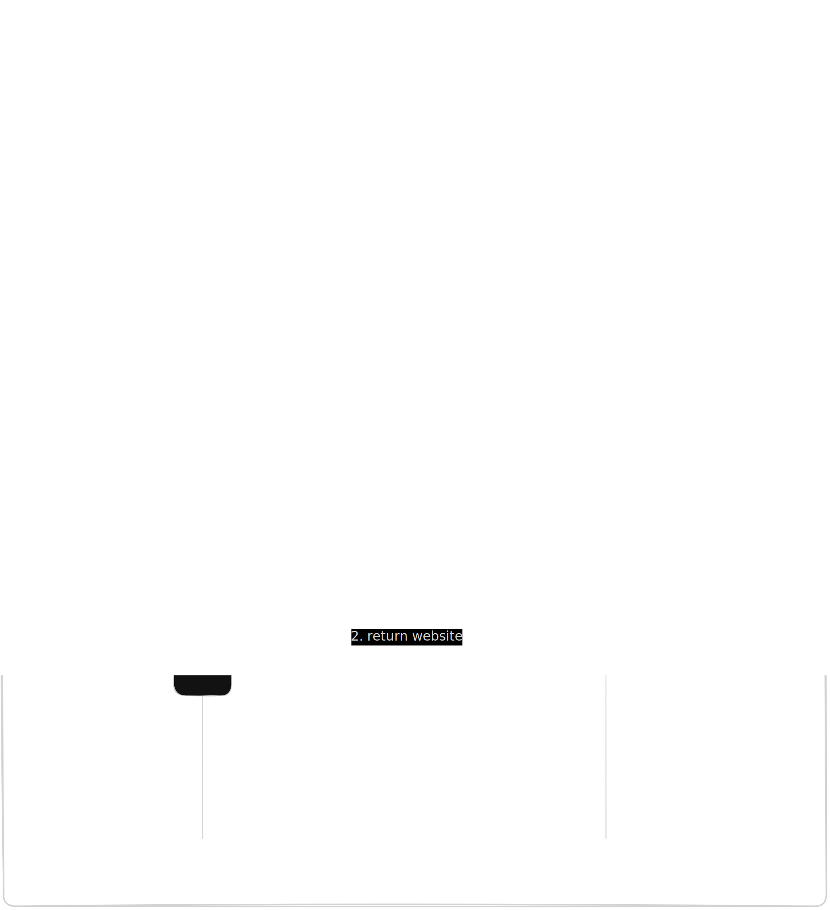
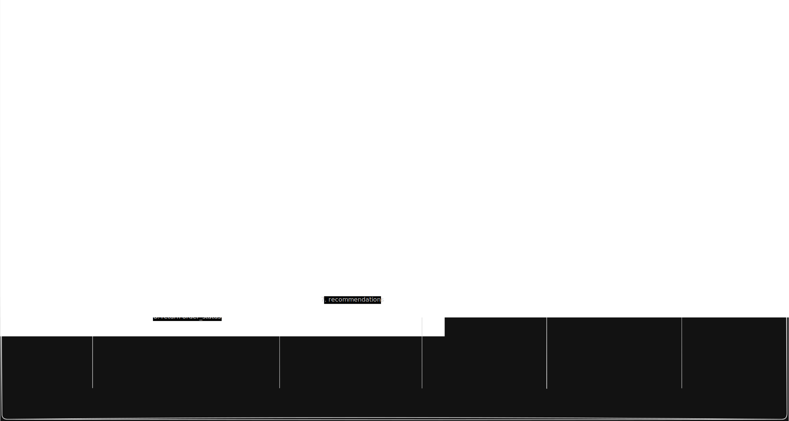

= Distributed system homework
:figure-caption!:

== Architecture Diagram

image::./docs/Images/Architecture_diagram.svg[Architecture Diagram]

The orangeish brown components represent components that are only connected to
the internal network, which means that they are only accessible from the internal
"docker" network. This is done because we want to minimize the possible attack
surface. 

== Sequence diagrams

=== Website loading flow

The image is the sequence diagram how the website loads. It does not say 
explicitly which functions are called only which microservices are called. 

=== Checkout flow

The image is the sequence diagram of the checkout process. The orchestrator
initiates multiple connections in the same time, because it uses coroutines, so
it can run code while it waits for the responses of the microservices.

== Event ordering
-  a: transaction-verification service verifies if the order items (books) are not an empty list.
-  b: transaction-verification service verifies if all mandatory user data (name, contact, address…) is filled in.
-  c: transaction-verification service verifies if the credit card information is in the correct format.
-  d: fraud-detection service checks the user data for fraud.
-  e: fraud-detection service checks the credit card data for fraud.
-  f: suggestions service generates book suggestions.

- A: a -> b -> c (it is so fast it would be premature optimization)
- B: d -> e  (it is so fast it would be premature optimization)
- C: f
	- (A || B) -> C (C is resource heavy, but still takes a long time)
