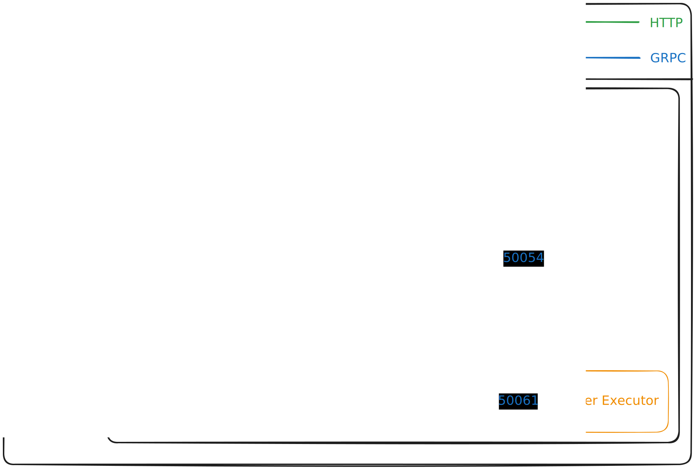
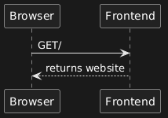
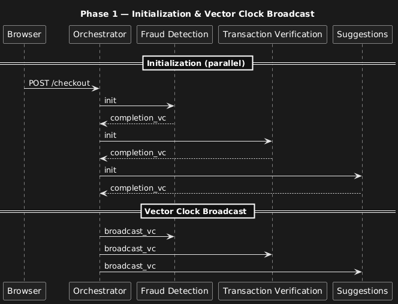
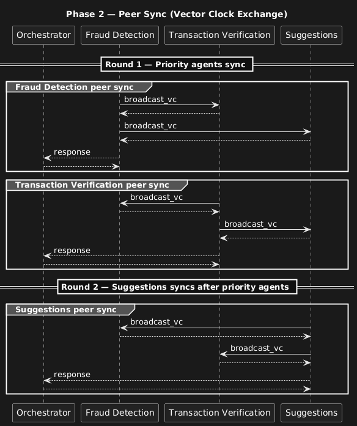
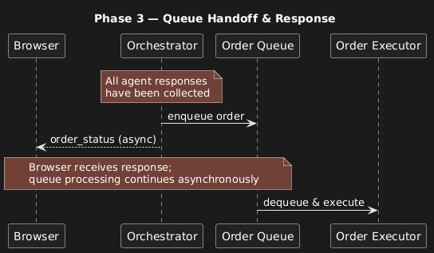
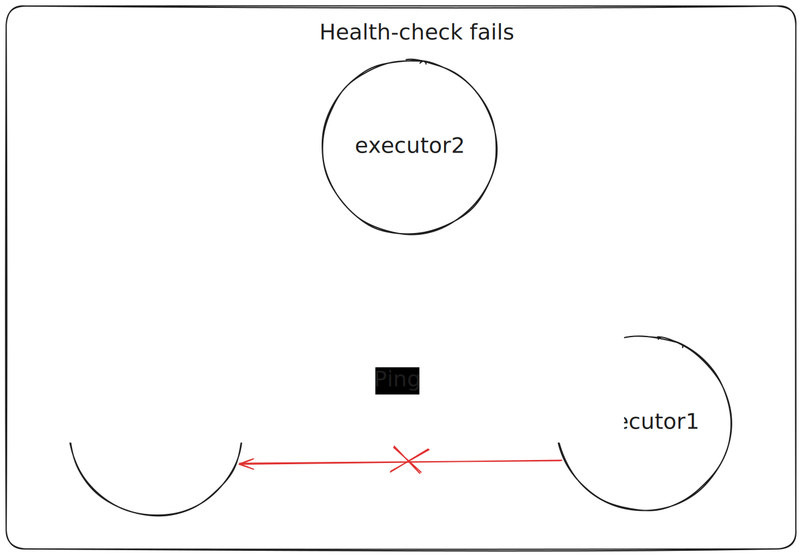
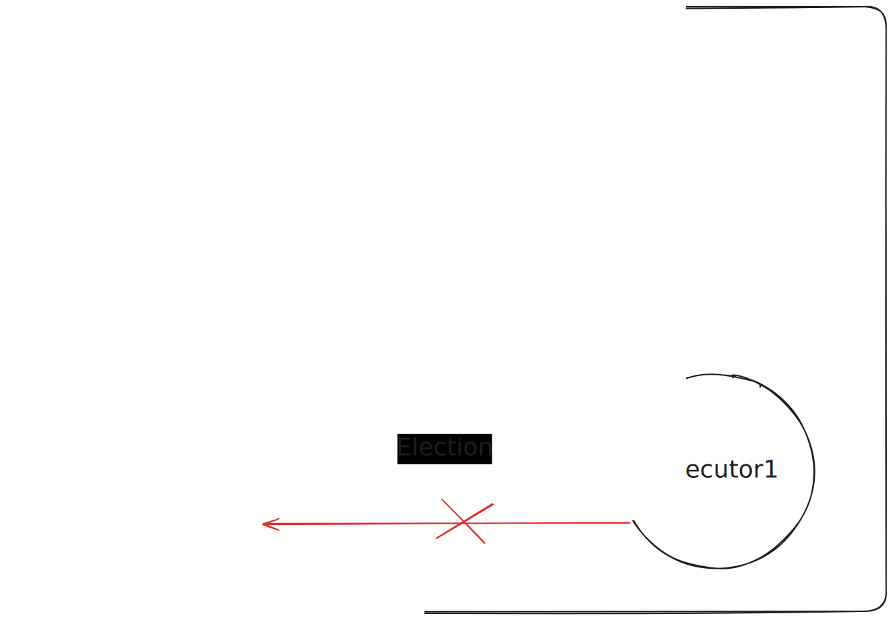
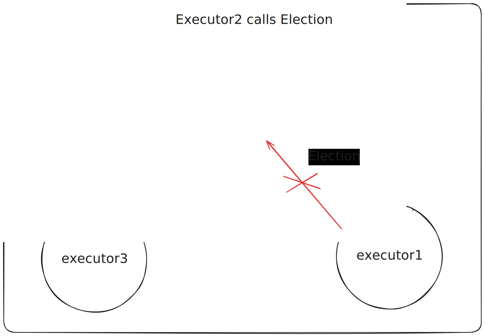
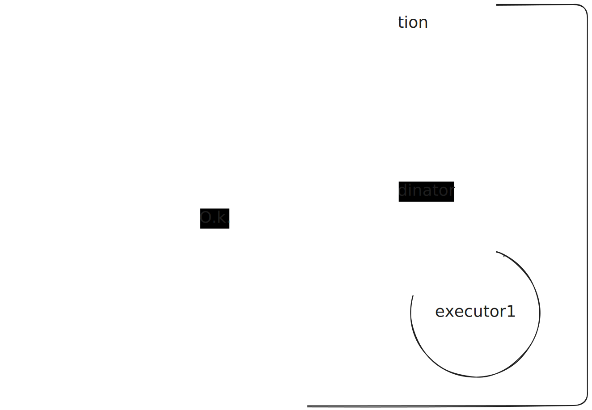

# Documentation

This folder should contain your documentation, explaining the structure and content of your project. It should also contain your diagrams, explaining the architecture. The recommended writing format is Markdown.

## Architecture diagrams

The orangeish brown components represent components that are only connected to
the internal network, which means that they are only accessible from the internal
"docker" network. This is done because we want to minimize the possible attack
surface. 

## Sequence diagrams

### Ordering a book
First the webserver returns the website to the client

Then the client sends the data to the api.
The orchestrator initiates the microservices then starts thoose that can be
started with the first vector clock broadcast.

The Fraud Detection and Transaction verification does their work paralelly and 
then if they both say everything is O.k. Suggestions start to work.

After all of the microservices returns an order is enqued and then the API return to
the user. The enqued order is processed in the background by Order Executor 
microservice.

## Leader election
There are multiple leader election algorithms that we can use to synchronise
our order executors. These algorithms include Bullying, Ring election, Paxos or Raft.
These algorithms have their specific usecases where they are applicable. 

Bullying is one of the simplest leader election algorithm that relies on a hierarchy
like node ids or ip addresses. If the healthcheck fails then the nodes ask each 
node that has a higher status if they are available, and if no node responded 
than they become the leader. The disadvantage for this algorithm is that this 
scales up badly with the node counts, so it is not a good choice if the system have 
a lot of nodes or the nodes are failig frequently.

Ring algorithm uses a ring structure where each node stores its successor, like 
in a linked list. If a node failes the healthcheck then a node sends an election
message to the next node which forwards it if it also thinks that the leader is 
not available. This is continued until the highest priority node is reached and 
then it becomes the leader. This is a great algorithm for nodes that can be arranged
into a ring structure. It has low overhead, but the ring can easily be destrupted.

Paxos is not a leader election algorithm, but a consensus algorithm, where the 
nodes have to agree on a valid value. Here the nodes has specific roles that 
they have to fulfill. This algortihm is complex but it can scale better, and it
can work in split brain systems with multi-paxos.

Raft is a protocol for leader election and log replication. It has high faliure 
tolerance but it is signigicantly harder to implement than Bullying.

### Bullying
Our choice was bullying for the following reasons. The specifications say that 
the algorithm should currently only work with 2 nodes. Which is not a lot, these 
nodes are in one single system, so network failures are not common. Therefore 
we went with the KISS principle keep it simple stupid. This makes that our implementation
has fewer bugs and it's easier to understand/maintain. In the future if this algorithm 
is not enough we can still replace it with a different one easily.

