# Documentation

This folder should contain your documentation, explaining the structure and content of your project. It should also contain your diagrams, explaining the architecture. The recommended writing format is Markdown.

## Architecture diagrams
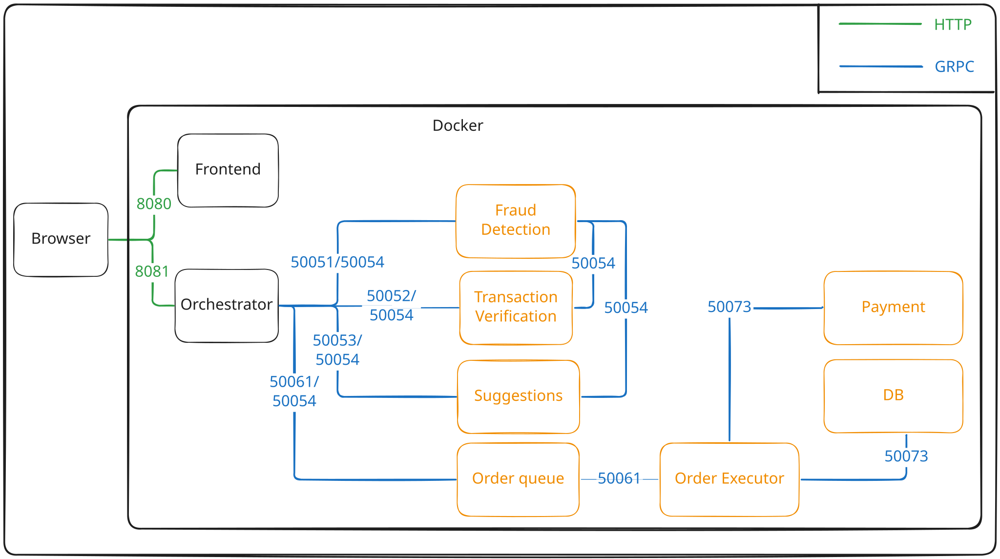

The orangeish brown components represent components that are only connected to
the internal network, which means that they are only accessible from the internal
"docker" network. This is done because we want to minimize the possible attack
surface. 

The grpc connections with 50051 50052 and 50053 ports are still used. They are
called when the orchestrator initializes the "worker" nodes with the order data
it returns the completion vector clocks. You can see them in the sequence diagrams 
below.

Now there are multiple ports for one single connection because we introduced the 
vector clock which communicate on its own port. This is the port 50054 in the 
architecture diagram. The broadcast facilitates the following operations. BroadcastService
which brooadcasts the vector clock. ClearMessage which clears the message que.

The orchestrator can now add items to the que with Enque operation with the grpc
connection that has port 50061 and Order Executor can Deque it using the same 
port.

## Sequence diagrams

### Ordering a book
First the webserver returns the website to the client

[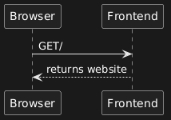](https://editor.plantuml.com/uml/SoWkIImgAStDuN8goYylJYrIqBLJS2lApoj9pKknKd1t3T7dWd4LT85oK6LM2aMf9QL5USKAvQb9nPabgLnS3a0b88C0)

Then the client sends the data to the api.
The orchestrator initiates the microservices then starts thoose that can be
started with the first vector clock broadcast.

[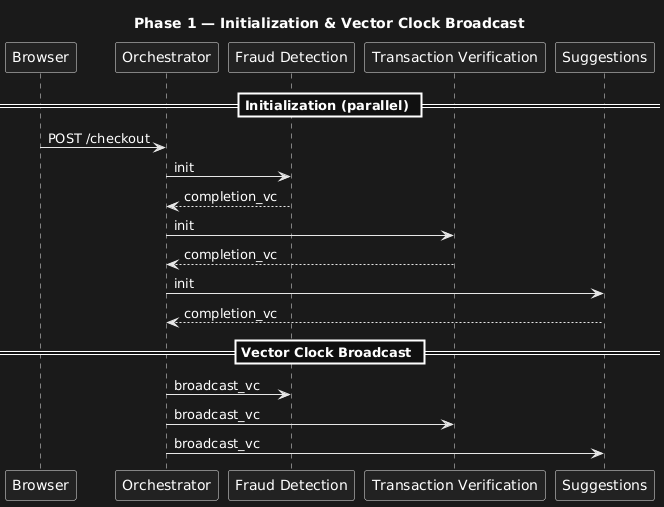](https://editor.plantuml.com/uml/XP9DJiCm48NtFiMe2mIB27MB2AeWIiMgbH9bMmsEQQswTcHFG6B58JWX9s5iVYIN5BRlUs_-x4KWz3GU30mx36g-qLQJ84r6mJegC8VtrpUuPrcZqIz8sbauWqv9SXxkZ9DxkFKEUuc1X1Yud9PwG4jHVWxAPzhAovqAv97J6PZL7iSUAaLScNlC00FKLUvfFTg0YVC4NZzgYJ_cjilCpRZTSYUc8T9cAKHP7YzopWaqHfaBA4iXlYQ6uYOR5AvWlMfQk6H9xjt8UsQOxNN5fdIyZ5mNnIUIxZ0O5NjkdkJlUDkTZ2VqJxnPdemdT1JdEqo_Nph2v6eFtvPOO7BwFnrfYimX5ihs_F4-0000)

The Fraud Detection and Transaction verification does their work paralelly and 
then if they both say everything is O.k. Suggestions start to work.

[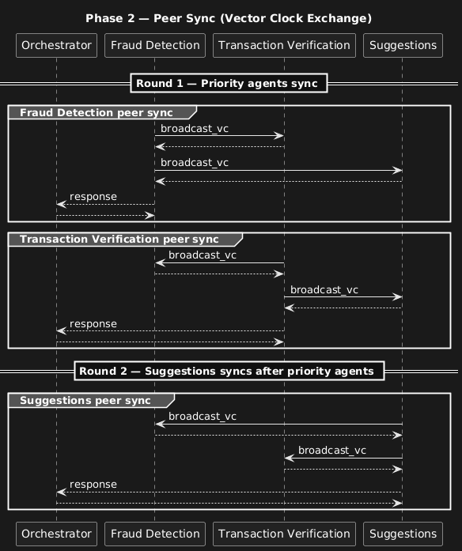](https://editor.plantuml.com/uml/VPEzJiCm58LtFyLH9nWoqB4Yg1BGZbIawbfT73UrABPbEuXkF0HFo9DmuxIXwT-ImUVO_iwvpZX4yh7-sC2jAQZXqYdbbs5hf8WwRXHcpJA6-Ft-mOmr5ApXPg5aj1wF6olVyVmbrsGgTIk4uzEqr8vCn8kNQnMY9tRsXC74KrtYIKK-HLip00LCdlgUkISJAEbOAAzNMb9ddYzwvgAkAhw9rT2enLI8FCUhhKs9knRTQ-jrt88gPM90an1vBaJbRUrm18IcXUGHO31a3tmZHdZpbaf98Iu_TyfzbZKmUrSnlUXYAFGgIQiiZk1LS8okZWqPdyYrA5FkEI-LqWDcrBJn58MLzjBETGvuvpeFd7gu1inj9E1k0EtREHnHmyc3MaLcTaU3-P_9uOx3U8ny8HuhNRpMTMvgErUQsacyrCUrUDnAYZVcB_ysVm00)

After all of the microservices returns an order is enqued and then the API return to
the user. The enqued order is processed in the background by Order Executor 
microservice.

[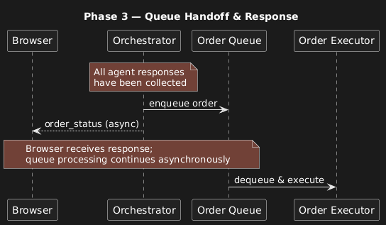](https://editor.plantuml.com/uml/RP5DJiD038NtSmghYmeaM7K74Yf8aTY5iAvK3PFN9jBK4yOpWUuu12Va93W_e1QnjR_t_6ol9TcOyi5JrrZ1QlkQaM5IcppeQIZHYhu-FgaQwlHekGwx7Itf6T855XZJgK7hsivoeeSOtWJnh5P6rq1Ij2cSDnPbh14dvmLPeRBwhr-ymsNLJaXX38S42hssJgtfXkwz9xk7IkESJZRSs1xq0Z2vu3rSGctCcV3wJYUh73mkJs4O-mTHPjvDmH7OwkLI5hgmScHtUHfh9gycsnzTX4FRGtx3tMxcWLqC3Y8jxpKZfvQpKgDj4mE7BFweaQinQA6EDIRTaZ3UHf-m1jVwnMy0)

## Leader election
There are multiple leader election algorithms that we can use to synchronise
our order executors. These algorithms include Bullying, Ring election, Paxos or Raft.
These algorithms have their specific usecases where they are applicable. 

Bullying is one of the simplest leader election algorithm that relies on a hierarchy
like node ids or ip addresses. If the healthcheck fails then the nodes ask each 
node that has a higher status if they are available, and if no node responded 
than they become the leader. The disadvantage for this algorithm is that this 
scales up badly with the node counts, so it is not a good choice if the system have 
a lot of nodes or the nodes are failig frequently.

Ring algorithm uses a ring structure where each node stores its successor, like 
in a linked list. If a node failes the healthcheck then a node sends an election
message to the next node which forwards it if it also thinks that the leader is 
not available. This is continued until the highest priority node is reached and 
then it becomes the leader. This is a great algorithm for nodes that can be arranged
into a ring structure. It has low overhead, but the ring can easily be destrupted.

Paxos is not a leader election algorithm, but a consensus algorithm, where the 
nodes have to agree on a valid value. Here the nodes has specific roles that 
they have to fulfill. This algortihm is complex but it can scale better, and it
can work in split brain systems with multi-paxos.

Raft is a protocol for leader election and log replication. It has high faliure 
tolerance but it is signigicantly harder to implement than Bullying.

### Bullying
Our choice was bullying for the following reasons. The specifications say that 
the algorithm should currently only work with 2 nodes. Which is not a lot, these 
nodes are in one single system, so network failures are not common. Therefore 
we went with the KISS principle keep it simple stupid. This makes that our implementation
has fewer bugs and it's easier to understand/maintain. In the future if this algorithm 
is not enough we can still replace it with a different one easily.

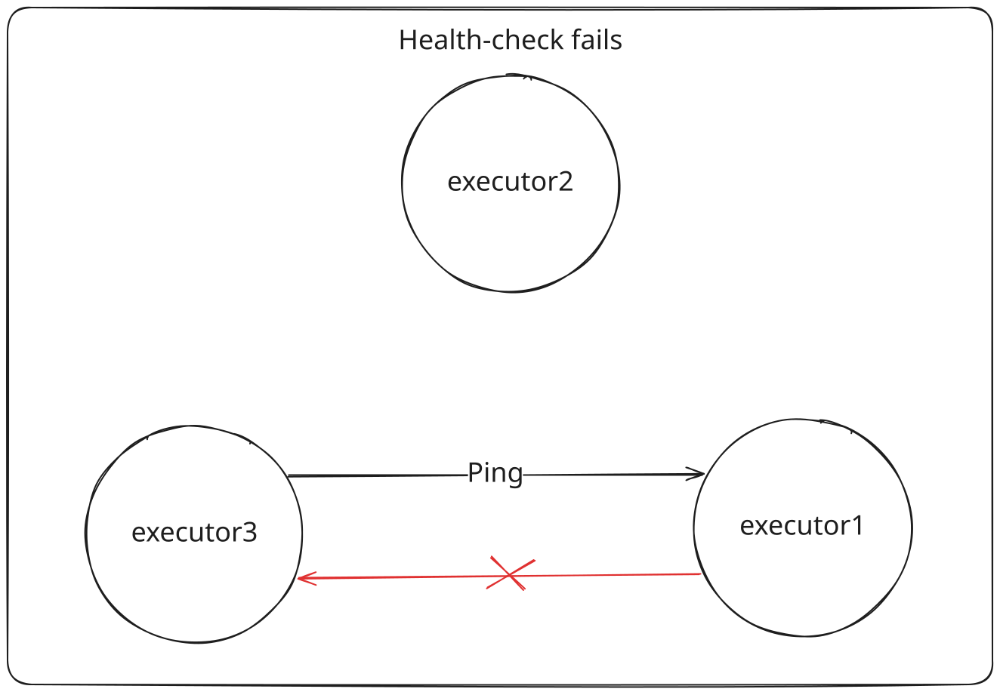
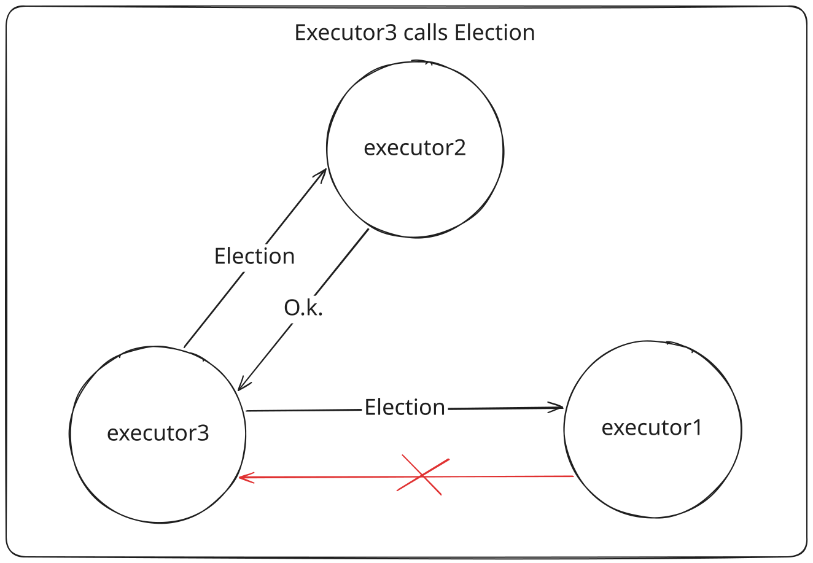
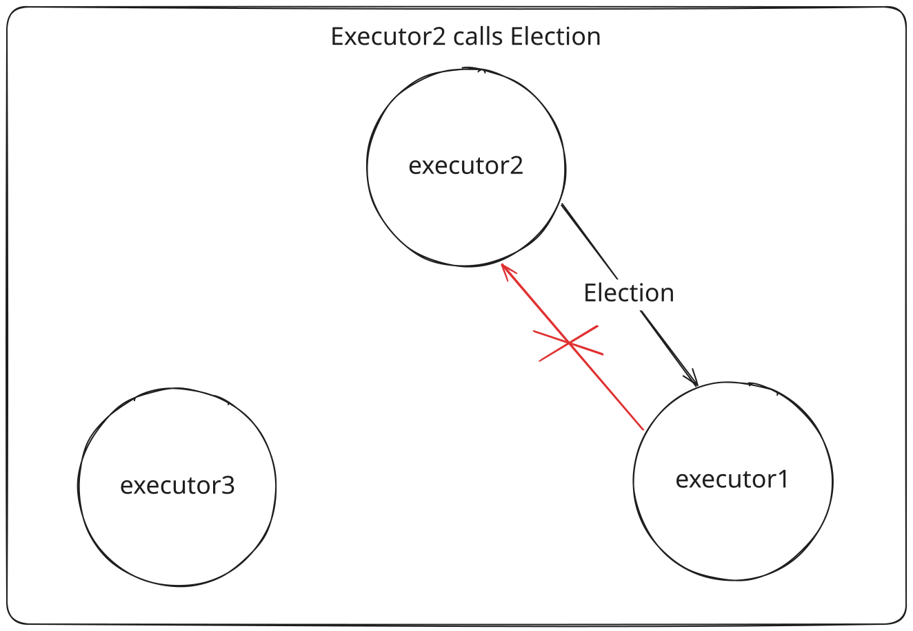
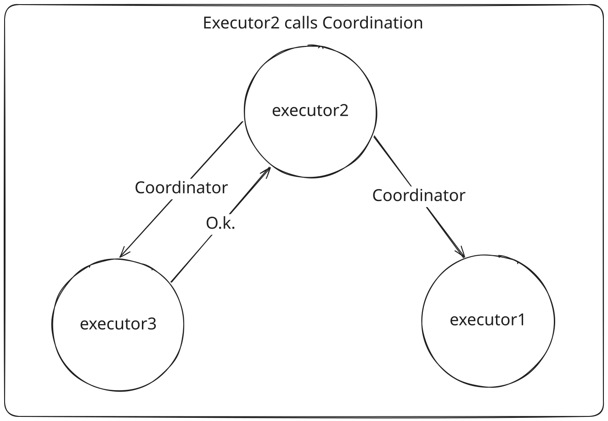

## Consistency in db
Our database uses the write all read any paradigm. This results in that the
system can handle a lot of read operations, but not so much write operations,
but this is enough for our applcation, beacuse the system will read the databse
more. Usually the system needs to fetch book once to know how many are stocked,
then it needs to read again if it wants to update the value. Moreover there will
be people who will not buy the books but carouse the catalog.

What other replication algorithms could we use? The system could have used Paxos,
Raft or any other quorum configuaration. Paxos and Raft are more complex algorithms
therefore they are more error prone (implementation). Write all rea any is really
simple. The system could have been used any other valid quorum configuaration,
but currently the application don't need write n, read k and it would result in
increased network traffic which is usually expensive in cloud providers, and 
it would have longer waiting times till all k quorums are read.

So this is primary consistency, which means that we have a primary node that is 
responsible for replicating the data. The advantage is that it is simple, and 
guarantees strong consistency without write conflicts, therefore it is easy to
debug. The problem is that it introduces a single point of failure, and the 
write operations does not scale that well. Moreover there is a replication lag
between the nodes. Currently we did not implement a leader election, but in 
a real system a leader election would have been neccesary.

Writing to the db:
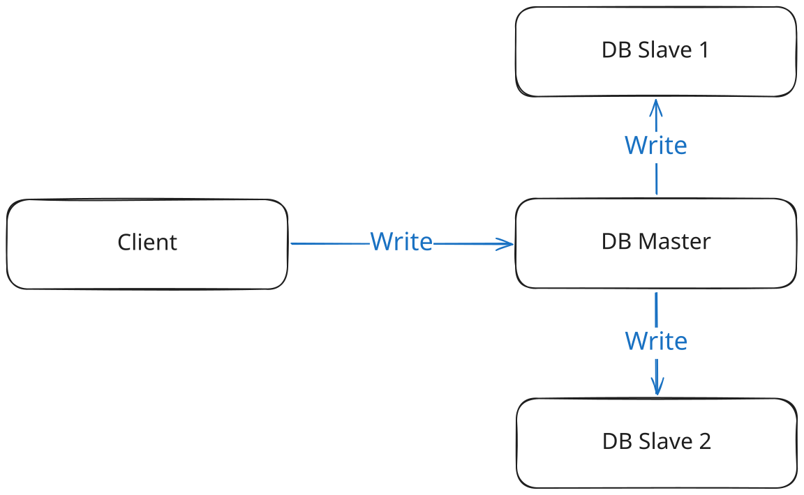

Reading from the db:
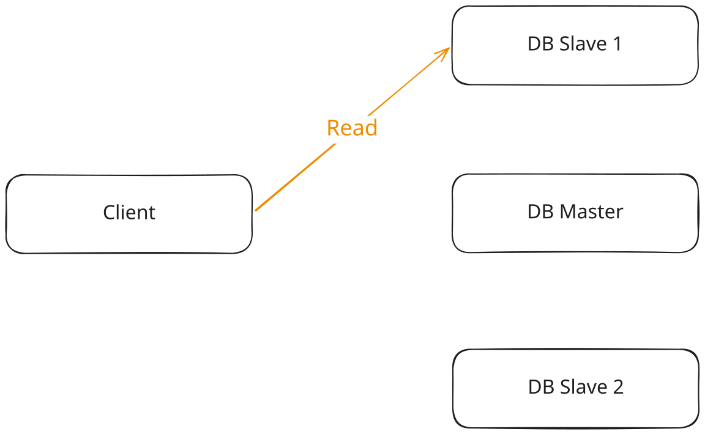

### Concurrent writes (bonus)
We can have concurrent writes (updates) to the same db instance and concurrent
updates to multiple db instances. The easier and more boring is the concurrent
writes to a single db and then replicating it to the other read only databases, 
this can scale up to a point and if we don't need that much write throughput 
this is a simple solution. With this we can handle multiple requests at the same
time from one backend which massively increases the output. For this to work 
we need a relational or nosql db like sqlite or postgres and the application 
needs to use locks (pessimistic locking) so that there are no write, read
conflicts during the update of a value. (currently we have a problem with it)
or the applcation can use etags (optimistic locking). With the read operation
the response has an etag field, that should be sent in the write request, the
db only writes the transaction if the etag is the same as in db. When a value
is written to the db etag should change. Last, but not least db can have an
atomic update operation. With our application the best would be the atomic
updates, because our main operation is the update, and the application does not 
really reads or writes the db besides updates. If we don't want or cannot do
atomic updates then etags are better in my opinion. Etags are usually better 
for 3 tier applications where the exector does not maintain a connection to the 
database during the whole operation.

Writing multiple dbs are a bit more interestign, here the dbs can use quorums 
with etags, or dbs can also use distributed locks which works between instances.
In this case I would advise the same atomic updates with quorum or etags with 
quorum.

## Distributed commitment
The application uses 2PC, there are multiple commitment protocols, like 3PC or 
Raft can be used to do this as well. We chose 2PC for the following reasons, it
is much more simpler than Raft, and a bit more simple than 3PC. On the other
hand 3PC would solve the issue with the coordiantor failing between Prepare and 
Commit Phases by introducing a Prepared to commit phase between them. The 
problem with this is it assumes that the network has bounded delays and nodes
have bounded response time, which is not true in real systems. Here in our toy
example network delays and response times are not problematic, but in real
systems they can cause problems. Moreover 3PC does not solve the problem of a
failing coordinator in another step, that write ahead logs (spoiler from next 
section) can solve.

### Algorithm
The coordinator starts the algorithm by preparing the operation, this means that
it sends a prepare message to all of the participants, each participant sends
back a response.

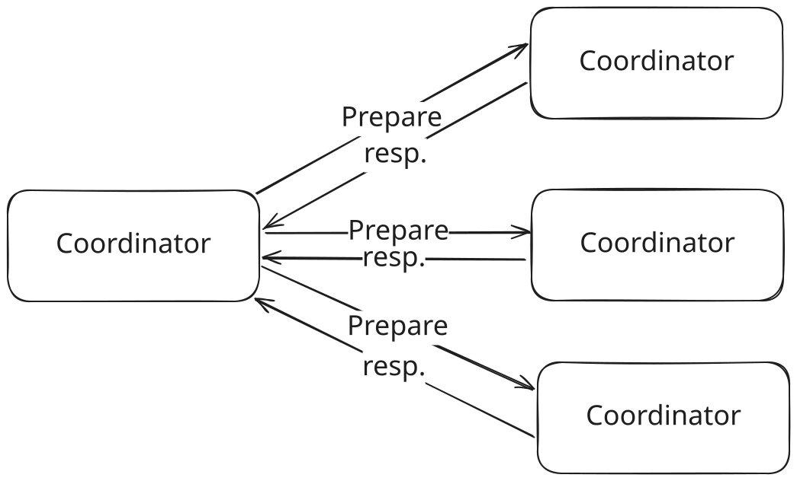

The participants should send back an O.k. (boolean true) if they successfully 
prepared the operation, or send back a Fail (boolean false) if they failed to
prepare the message.

If every participant sent back an O.k. the coordinator sends a Commit message to
the participants. If the participants recieve the Commit message they know that
everybody else's operation will be done so they can do their operation.

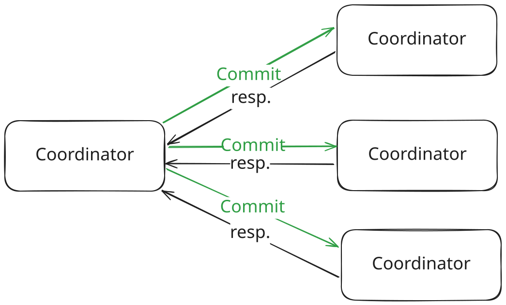

If at least one of the participant sends back a Fail beacuse they are not able 
to do the operation then the coordinator aborts the operation by sending and 
Abort message. If the participant recieves an Abort it knows that somebody is 
not able to do the operation so they discard the operation, because it would 
be worse to do a transaction half, than to fail it.

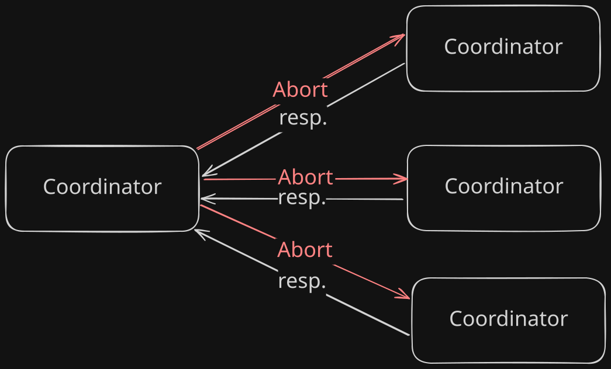

### What if coordinator fails? (Bonus point)
The coordiantor can fail before prepare it is fine and the algorithm does not
have any problems. If the algorithm fails after prepare messeges were sent, then
the recipients will store that the data is prepared, but not commited or aborted
this way if the coordinator fails a lot the other participants will eat a lot of 
system resources. It can be solved by simply deleting those items in an interval
if the message loss is acceptable, if not then a write ahead log can be used. 
With write ahead logs the coordinator writes down what it did into a persistent 
storage so after restart it can read the instructions and replay them. This is 
simple, but during the recovery phase it blocks every other transaction. The 
system can also use a leader election algorithm that also sends which state the 
system currently is, which is more complex than write ahead logs, but other 
instances of the controller can become master and resume the operation.

